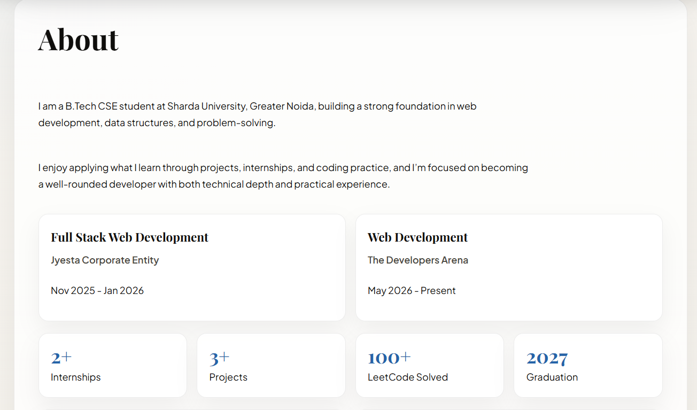
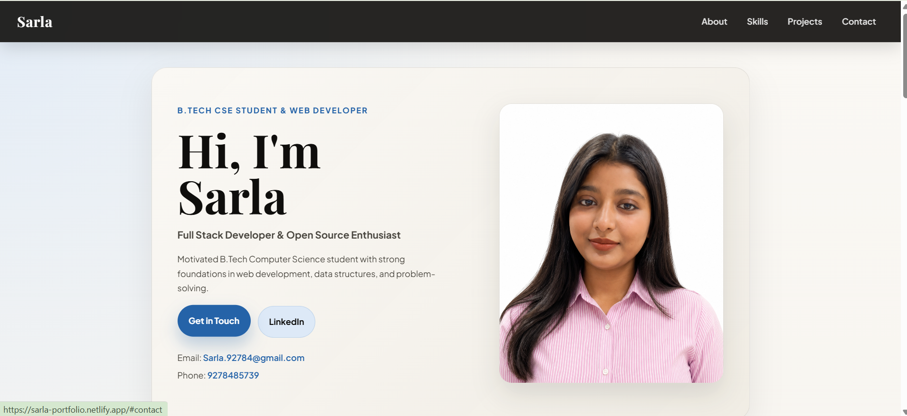

# 🌐 Interactive Portfolio Website

## Project Overview

A personal portfolio website built with HTML5, CSS3, and JavaScript showcasing my skills, projects, and contact information.

**Objectives:**
- Create a fully structured HTML5 portfolio
- Use semantic HTML tags throughout
- Include working contact form with validation
- Make it responsive for mobile devices
- Add JavaScript interactivity and dynamic content

---

## Setup Instructions

1. Clone the repository:
   ```
   git clone https://github.com/sarla92784/portfolio
   ```
2. Open the project folder in VS Code
3. Add your photo as `images/profile.jpg`
4. Right-click `index.html` and select "Open with Live Server"
5. Live site: https://sarla-portfolio.netlify.app

---

## Code Structure

```
portfolio/
├── index.html       → Main portfolio page
├── style.css        → All styles including dark mode
├── script.js        → All JavaScript features (Week 3)
├── README.md        → Project documentation
├── images/
│   └── profile.jpg
└── screenshots/
    ├── desktop-view-hero.png
    ├── desktop-view-about.png
    ├── mobile-view.png
    └── hover-effect.png
```

---

## How I Met the Technical Requirements

- `index.html`: Created with proper HTML5 DOCTYPE, `lang` attribute, meta tags
- 3+ Sections: About, Skills, Projects, Contact all included
- Semantic HTML: Used `header`, `nav`, `main`, `section`, `article`, `footer` tags
- Contact Form: Built with name, email, subject, message fields — all with `required` and validation attributes
- Images: Profile photo with descriptive alt text for accessibility
- Internal Navigation: Nav links use `href="#about"`, `"#skills"`, `"#projects"`, `"#contact"` with smooth scroll

---

## HTML Concepts Learned

- Semantic tags give meaning to page structure
- Forms use input types and `required` attributes for validation
- Alt text on images helps accessibility and SEO
- Internal anchor links connect sections on the same page
- CSS variables make styling consistent and easy to update

---

## CSS Concepts & Design Decisions

### CSS Selectors Used
- **Element selectors**: `body`, `section`, `h2`, `img` — base styling for HTML elements
- **Class selectors**: `.hero-cta`, `.project-card`, `.skill-group`, `.tag` — reusable component styles
- **ID selectors**: `#about`, `#skills`, `#projects`, `#contact` — unique section targeting
- **Pseudo-class selectors**: `:hover` and `:focus-visible` on buttons, nav links, and form inputs for interactivity

### Color Scheme
CSS custom properties (variables) defined in `:root` create a consistent cream and ink color palette with a blue accent color (`--accent: #2563a8`), making the design easy to maintain and update globally.

### Layout Techniques
- **CSS Grid** is used for `.skills-grid`, `.projects-grid`, `.stat-grid`, and `.card-grid` to create flexible multi-column layouts
- **Flexbox** is used for `.site-nav ul`, `.hero-actions`, and `.tag-row` for simple row-based alignment

### Hover & Interactive Effects
- Buttons lift slightly and change shadow on hover
- Navigation links get a subtle background highlight on hover
- Cards lift on hover with increased shadow
- Form inputs change border color and add a glow effect on focus

### Responsive Design Approach
- Media query at `900px`: collapses the hero into a single column, stacks the contact layout
- Media query at `600px`: further reduces padding, makes buttons full-width, adjusts font sizes
- Used `clamp()` for fluid typography that scales smoothly between screen sizes

---

## JavaScript Features Implemented (Week 3)

### 1. 🌙 Dark / Light Mode Toggle
- Button toggles `dark-mode` class on `<body>`
- Preference saved in `localStorage` — persists on page reload
- Button label updates dynamically

### 2. ✅ Contact Form Validation with Real-Time Feedback
- Validates name, email, subject, and message on submit
- Email checked with regex: `/^[^\s@]+@[^\s@]+\.[^\s@]+$/`
- Inline error messages shown in red next to each field
- Errors clear as user types (real-time via `input` event)
- Green success message shown on valid submission

### 3. 📊 Skills Progress Bar Animation
- `IntersectionObserver` detects when Skills section scrolls into view
- Bars animate from 0% to target width using CSS transitions
- Runs only once per page load

### 4. 🖼️ Image Slider / Gallery
- Prev / Next buttons to navigate project screenshots
- Auto-advances every 4 seconds
- Clickable dot indicators show current slide

### 5. ✏️ To-Do Task List
- Dynamically adds `<li>` elements using `createElement`
- Click task to mark done (strikethrough toggle)
- Delete button removes task from DOM
- Tasks saved in `localStorage` — persist after page refresh

### 6. 🔗 Smooth Scroll Navigation
- All `href="#section"` links use `scrollIntoView({ behavior: 'smooth' })`

### 7. ⬆️ Scroll-to-Top Button
- Appears after scrolling 300px down
- Smooth scrolls back to top on click

### 8. 🔵 Active Nav Link Highlight
- Listens to `scroll` event, adds `.active` class to current section's nav link

### 9. ⌨️ Typing Effect for Hero Section
- Types hero greeting character by character using `setInterval`

---

## DOM Manipulation Used

| Technique | Where Used |
|---|---|
| `document.getElementById()` | Form fields, buttons, containers |
| `document.querySelectorAll()` | Nav links, slides, skill bars |
| `classList.toggle()` | Dark mode, task done state |
| `createElement() / appendChild()` | To-do list items, slider dots |
| `element.remove()` | Deleting tasks |
| `textContent` | Typing effect, button labels |

---

## Event Listeners Used

| Event | Purpose |
|---|---|
| `click` | Dark mode, slider, tasks, scroll-to-top |
| `submit` | Form validation |
| `input` | Real-time error clearing |
| `scroll` | Scroll-to-top visibility, nav highlight |
| `keydown` | Enter key to add task |

---

## Local Storage Usage

```js
// Dark mode preference
localStorage.setItem('darkMode', true/false);

// To-do tasks
localStorage.setItem('portfolioTasks', JSON.stringify(tasks));
```

---

## Screenshots




---

## Live Website

🌐 https://sarla-portfolio.netlify.app

## Validation

✅ Validated with W3C HTML Validator — No errors or warnings